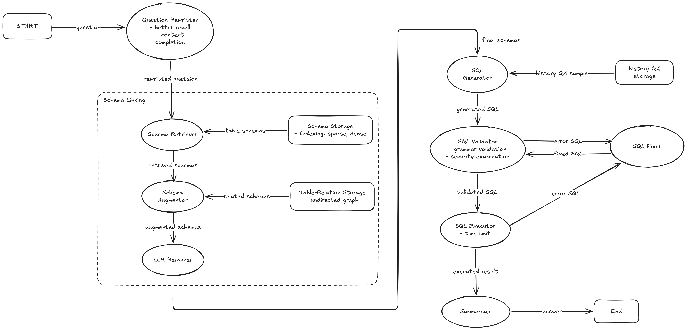

# DataHunt
## 项目简介
DataHunt 是一个自然语言转 SQL (Text-to-SQL) 智能体工具。

## Workflow

## 核心特性
### Agentic Workflow
* **全链路节点**：包含问题改写、表召回、SQL生成、安全校验、结果总结。
* **自我纠错**：在 SQL 生成后引入闭环的校验与重试机制，降低模型幻觉。
* **性能指标**：在 **BIRD Mini-dev** 评估集上，执行成功率 (EX) 达到 **66.4%**。

### Schema Linking
* **元信息增强**：对数据表的元信息（Meta-data）进行结构化处理，包括列值采样、字段描述补充与标准化格式化，提升底层检索精确度。
* **混合检索机制**：底层采用 **稀疏检索 (Sparse) + 稠密检索 (Dense)** 的双路召回策略。
* **LLM 智能重排**：设计专门的 LLM Reranker，通过高阶 Prompt 工程（量化评分规则、CoT few-shots、Recall First 策略）进行二次精准排序。
* **性能指标**：在 **BIRD Mini-dev** 评估集上实现 **100% 表召回率**，MAP (Mean Average Precision) 提升至 **0.88**。

### Historical Data-driven Learning
* **关系图拓展**：解析历史 SQL 语句并构建“数据表关系图”。在基础召回后，基于关系图补充强关联表。
* **Dynamic Few-shots**：在 SQL 生成前，提取当前问题的逻辑骨架 (Skeleton) 进行向量化检索。匹配最相似的历史 QA 对作为动态示例，提升 SQL 生成的准确率。
